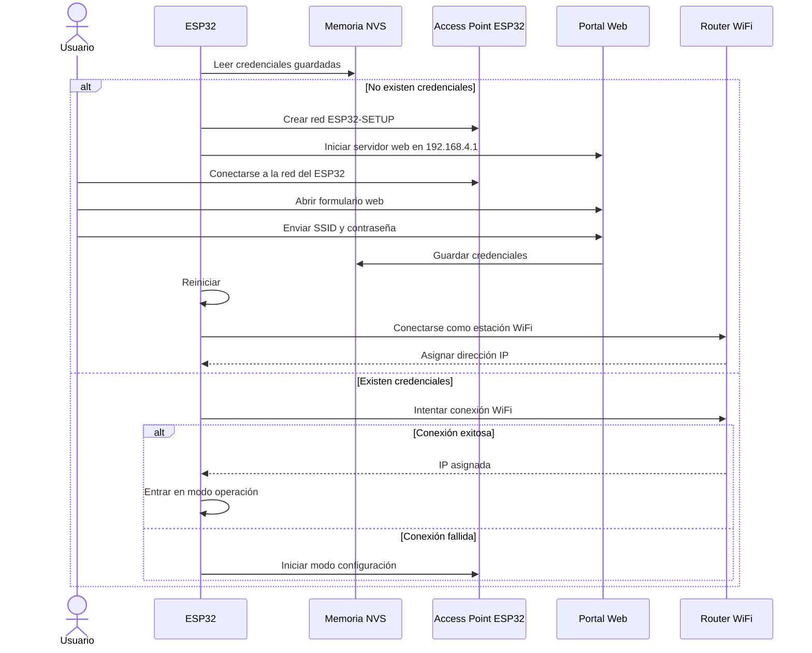
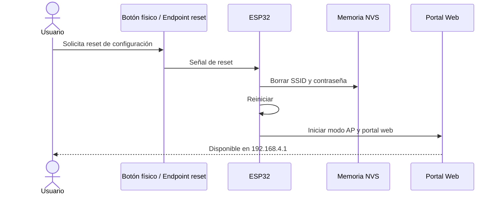
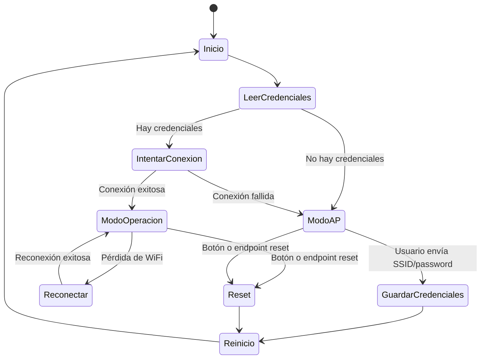

# ESP32 WiFi Provisioning Lab
## Universidad de la Sabana - Internet de las cosas (2026-1) 
## Jorge Esteban Diaz Bernal - Carlos Augusto Sanchez Lombana - Laura Camila Rodriguez Leon - Andrea Paola Urdaneta Rosales

## 1. Descripción
Este proyecto implementa una solución de aprovisionamiento WiFi para ESP32 usando Arduino, permitiendo configurar dinámicamente el SSID y la contraseña de una red inalámbrica sin necesidad de reprogramar el microcontrolador.

La solución está pensada para escenarios reales de Internet de las Cosas en los que un dispositivo debe ser instalado por un usuario final en diferentes redes WiFi. En lugar de dejar las credenciales quemadas directamente en el código fuente, el ESP32 inicia un portal web local cuando no encuentra credenciales guardadas o cuando falla la conexión a la red configurada.

Desde este portal, el usuario puede ingresar el nombre de la red WiFi y su contraseña. Posteriormente, el ESP32 guarda esta información en memoria no volátil y reinicia para conectarse automáticamente como estación WiFi.

  La solución contempla:
  - Modo Access Point para configuración inicial.
  - Interfaz web local amigable.
  - Almacenamiento persistente de credenciales.
  - Reconexión automática.
  - Reset de configuración mediante botón físico o endpoint HTTP.
  - Documentación de endpoints.
  - Diagramas de arquitectura y secuencia.
  - Validación funcional mediante prototipado

## 2. Objetivos
- Iniciar en modo AP si no existen credenciales.
- Permitir configuración mediante portal web.
- Guardar credenciales en memoria no volátil.
- Reconectar automáticamente.
- Permitir reset de configuración.
- Documentar endpoints y validación funcional.

## 3. Arquitectura

### 3.1. Descripción general

La arquitectura propuesta se basa en un flujo de configuración local. El ESP32 puede operar en dos modos principales:

**Modo configuración / Access Point:**
El ESP32 crea una red WiFi propia, por ejemplo `ESP32-SETUP-XXXX`, y levanta un servidor web local en la dirección `192.168.4.1`.

**Modo operación / Station:**
El ESP32 se conecta a la red WiFi configurada por el usuario y queda listo para integrarse a un ecosistema IoT mayor, como un broker MQTT, dashboard web, servidor de telemetría o plataforma en la nube.

La memoria no volátil se implementa mediante la librería `Preferences`, propia del entorno Arduino-ESP32. Esta librería utiliza NVS (memoria no volátil del ESP32) y es recomendada como reemplazo moderno de `EEPROM` para guardar valores pequeños como credenciales, parámetros de configuración o estados persistentes.

### 3.2. Diagrama de bloques

```mermaid
flowchart LR
    U[Usuario final<br/>Celular o computador] -->|Se conecta al AP| AP[ESP32 en modo Access Point<br/>Red: ESP32-SETUP-XXXX]

    AP --> DNS[DNSServer<br/>Redirección tipo portal cautivo]
    DNS --> WEB[WebServer local<br/>IP: 192.168.4.1]
    WEB --> PORTAL[Portal web de configuración<br/>Formulario SSID y contraseña]

    PORTAL -->|POST /save| NVS[Memoria no volátil NVS<br/>Preferences.h]
    NVS --> RESTART[Reinicio del ESP32]

    RESTART --> STA[ESP32 en modo Station]
    STA -->|Conexión WiFi| ROUTER[Router WiFi del usuario]
    ROUTER --> IOT[Ecosistema IoT<br/>MQTT / Dashboard / Nube]

    BTN[Botón físico GPIO27] -->|Presionado 4 segundos| RESET[Reset de credenciales]
    WEB -->|POST /api/reset| RESET
    RESET --> NVS
    RESET --> RESTART

    STA --> STATUS[Endpoint /api/status<br/>Consulta de modo, IP, SSID y memoria]
```

    
### 3.3. Componentes de software

| Módulo          | Responsabilidad                                               |
|-----------------|---------------------------------------------------------------|
| `WiFi.h`        | Gestionar modo AP y modo Station del ESP32                    |
| `WebServer.h`   | Levantar servidor HTTP local                                  |
| `DNSServer.h`   | Redirigir solicitudes al portal de configuración              |
| `Preferences.h` | Guardar y leer credenciales desde memoria no volátil          |
| Portal HTML     | Interfaz para ingresar SSID y contraseña                      |
| Botón físico    | Permitir reset manual de configuración                        |
| Endpoints HTTP  | Consultar estado, guardar credenciales y borrar configuración |

### 3.4. Restricciones de diseño

| Restricción                | Consideración de diseño                                                          |
|----------------------------|----------------------------------------------------------------------------------|
| Memoria limitada del ESP32 | Se usa HTML embebido y almacenamiento simple en NVS                              |
| Usuario no técnico         | Se implementa portal web local en lugar de configuración por serial              |
| Cambio de red WiFi         | Se agrega botón físico y endpoint de reset                                       |
| Seguridad básica           | La red AP tiene contraseña y las credenciales no se imprimen completas en Serial |
| Prototipado rápido         | Se usa Arduino IDE y librerías estándar de Arduino-ESP32                         |
| Concurrencia limitada      | El portal está pensado para un usuario configurando el dispositivo a la vez      |

## 4. Hardware

### 4.1. Materiales

| Componente                 | Cantidad | Función                          |
|----------------------------|:--------:|----------------------------------|
| ESP32 DevKit               |    1     | Microcontrolador principal       |
| Cable USB                  |    1     | Alimentación y programación      |
| Botón pulsador             |    1     | Reset físico de credenciales     |
| Protoboard                 |    1     | Montaje del prototipo            |
| Jumpers                    |  Varios  | Conexiones                       |
| LED (opcional)             |    1     | Indicación visual de estado      |
| Resistencia 220 Ω (opcional)|   1     | Limitación de corriente para LED |

### 4.2. Conexión del botón de reset

El botón se conecta entre el pin `GPIO27` y `GND`.

En el código se configura el pin con `INPUT_PULLUP`, por lo tanto:

- Sin presionar: el pin lee `HIGH`.
- Presionado: el pin lee `LOW`.

Si el botón se mantiene presionado durante aproximadamente **4 segundos**, el ESP32 borra las credenciales guardadas y reinicia en modo configuración.

### 4.3. Esquemático de interconexión
+-------------------+
|      ESP32        |
|                   |
| GPIO27 -----------+------ Botón ------ GND
|                   |
| USB --------------+------ Computador / Fuente 5V
|                   |
| GND --------------+------ Tierra común
+-------------------+

## 5. Funcionamiento

### 5.1. Flujo de arranque

Cuando el ESP32 se enciende, ejecuta la siguiente lógica:

1. Inicializa comunicación serial.
2. Configura el botón de reset.
3. Lee las credenciales WiFi guardadas en memoria no volátil.
4. Si existen credenciales:
   - Intenta conectarse a la red WiFi.
   - Si la conexión es exitosa, entra en modo operación.
   - Si la conexión falla, entra en modo configuración.
5. Si no existen credenciales:
   - Entra directamente en modo configuración.

### 5.2. Modo configuración

En este modo, el ESP32 funciona como Access Point. Crea una red WiFi propia con un nombre similar a:
ESP32-SETUP-ABCD

El usuario se conecta a esa red usando un celular o computador. Luego abre el navegador e ingresa a: 192.168.4.1

Allí encuentra un formulario web donde puede ingresar el SSID y la contraseña de la red WiFi. Después de guardar los datos, el ESP32 almacena la información en memoria no volátil y reinicia.

### 5.3. Modo operación

Después de guardar credenciales, el ESP32 reinicia e intenta conectarse como estación WiFi. Si la conexión es exitosa:

- El ESP32 obtiene una dirección IP del router.
- El servidor HTTP sigue disponible en la red local.
- El endpoint `/api/status` permite consultar el estado del dispositivo.
- El dispositivo queda listo para integrarse con un sistema IoT mayor.

### 5.4. Reconexión automática

El sistema revisa si la conexión WiFi se pierde durante la operación normal. Si detecta desconexión, intenta reconectarse automáticamente usando:

```cpp
WiFi.reconnect();
```

### 5.5. Restablecimiento de configuración

El sistema ofrece dos formas de borrar credenciales:

**Opción 1 - Botón físico:** mantener presionado el botón conectado al `GPIO27` durante 4 segundos.

**Opción 2 - Endpoint HTTP:** enviar una solicitud `POST` a `/api/reset`.

Después de borrar credenciales, el ESP32 reinicia y vuelve a crear el portal de configuración.

## 6. Endpoints

### 6.1. `GET /`

| Campo              | Valor                                                  |
|--------------------|--------------------------------------------------------|
| URL                | `/`                                                    |
| Método             | `GET`                                                  |
| Headers requeridos | Ninguno                                                |
| Query params       | Ninguno                                                |
| Payload            | Ninguno                                                |
| Respuesta exitosa  | `200 text/html`                                        |
| Función            | Mostrar formulario web para ingresar SSID y contraseña |

**Ejemplo de solicitud:**

```http
GET / HTTP/1.1
Host: 192.168.4.1
```

**Ejemplo de respuesta:**

```http
HTTP/1.1 200 OK
Content-Type: text/html
```

La respuesta contiene una página HTML con un formulario para ingresar las credenciales WiFi.

---

### 6.2. `POST /save`

| Campo              | Valor                                             |
|--------------------|---------------------------------------------------|
| URL                | `/save`                                           |
| Método             | `POST`                                            |
| Headers            | `Content-Type: application/x-www-form-urlencoded` |
| Query params       | Ninguno                                           |
| Payload            | `ssid`, `password`                                |
| Respuesta exitosa  | `200 text/html`                                   |
| Respuesta de error | `400 text/html`                                   |
| Función            | Guardar credenciales WiFi en memoria no volátil   |

**Payload:** ssid=MiRedWiFi&password=MiPassword123
**Respuesta exitosa:**

```html
<h2>Credenciales guardadas</h2>
<p>El ESP32 se reiniciará e intentará conectarse a la red configurada.</p>
```

**Posibles errores:**

| Código | Causa              |
|-------:|--------------------|
|    400 | No se envió SSID   |
|    400 | El SSID está vacío |

---

### 6.3. `GET /api/status`

| Campo              | Valor                                              |
|--------------------|----------------------------------------------------|
| URL                | `/api/status`                                      |
| Método             | `GET`                                              |
| Headers requeridos | Ninguno                                            |
| Query params       | Ninguno                                            |
| Payload            | Ninguno                                            |
| Respuesta exitosa  | `200 application/json`                             |
| Función            | Consultar modo, conexión, SSID, IP y memoria libre |

**Ejemplo de solicitud:**

```http
GET /api/status HTTP/1.1
Host: 192.168.1.34
```

**Respuesta en modo operación:**

```json
{
  "mode": "STA",
  "connected": true,
  "ssid": "MiRedWiFi",
  "ip": "192.168.1.34",
  "freeHeap": 213456
}
```

**Respuesta en modo configuración:**

```json
{
  "mode": "AP_CONFIG",
  "connected": false,
  "ssid": "ESP32-SETUP-ABCD",
  "ip": "192.168.4.1",
  "freeHeap": 211320
}
```

---

### 6.4. `POST /api/reset`

| Campo              | Valor                          |
|--------------------|--------------------------------|
| URL                | `/api/reset`                   |
| Método             | `POST`                         |
| Headers requeridos | Ninguno                        |
| Query params       | Ninguno                        |
| Payload            | Ninguno                        |
| Respuesta exitosa  | `200 text/html`                |
| Función            | Restablecer configuración WiFi |

**Ejemplo de solicitud:**

```http
POST /api/reset HTTP/1.1
Host: 192.168.1.34
```

**Respuesta:**

```html
<h2>Configuración borrada</h2>
<p>El ESP32 se reiniciará en modo configuración.</p>
```

---

### 6.5. Endpoints auxiliares de portal cautivo

| Endpoint               | Método | Función                    |
|------------------------|--------|----------------------------|
| `/generate_204`        | GET    | Redirección para Android   |
| `/hotspot-detect.html` | GET    | Redirección para iOS/macOS |
| `/fwlink`              | GET    | Redirección para Windows   |

## 7. Diagramas UML

### 7.1. Diagrama de secuencia: configuración inicial



### 7.2. Diagrama de secuencia: reset de credenciales



### 7.3. Diagrama de estados



## 8. Validación

### 8.1. Plan de pruebas

| ID  | Prueba                  | Procedimiento                             | Resultado esperado                                | Estado   |
|-----|-------------------------|-------------------------------------------|---------------------------------------------------|----------|
| P01 | Inicio sin credenciales | Borrar memoria y reiniciar ESP32          | El ESP32 crea una red `ESP32-SETUP-XXXX`          | Aprobado |
| P02 | Acceso al portal        | Conectarse al AP y abrir `192.168.4.1`    | Se muestra el formulario web                      | Aprobado |
| P03 | Guardar credenciales    | Enviar SSID y contraseña válidos          | El ESP32 guarda datos y reinicia                  | Aprobado |
| P04 | Conexión automática     | Reiniciar después de guardar credenciales | El ESP32 se conecta a la red configurada          | Aprobado |
| P05 | Consulta de estado      | Acceder a `/api/status`                   | Se recibe JSON con modo, SSID, IP y memoria libre | Aprobado |
| P06 | Reset por botón         | Mantener presionado el botón 4 segundos   | Se borran credenciales y vuelve al modo AP        | Aprobado |
| P07 | Reset por endpoint      | Enviar `POST /api/reset`                  | Se borran credenciales y reinicia en modo AP      | Aprobado |
| P08 | Contraseña incorrecta   | Guardar clave WiFi inválida               | El ESP32 no conecta y vuelve a modo configuración | Aprobado |
| P09 | Pérdida de red          | Apagar temporalmente el router            | El ESP32 intenta reconectarse automáticamente     | Aprobado |

### 8.2. Criterios de aceptación

- El ESP32 inicia en modo AP cuando no hay credenciales guardadas.
- El usuario puede ingresar SSID y contraseña desde una interfaz web.
- Las credenciales se conservan después de reiniciar o desconectar la alimentación.
- El ESP32 se conecta automáticamente a la red configurada.
- Es posible borrar las credenciales para configurar una nueva red.
- Los endpoints funcionan de acuerdo con la documentación.
- El prototipo físico permite validar todas las transiciones del sistema.

## 9. Comparación de memoria Flash

### 9.1. Metodología

Para comparar la memoria Flash usada por la implementación propia frente al ejemplo `Basic` de WiFiManager, se compilaron ambos programas bajo las mismas condiciones:

- Misma placa seleccionada en Arduino IDE.
- Mismo core de Arduino-ESP32.
- Mismo esquema de particiones.
- Misma frecuencia de CPU.
- Mismas opciones de compilación.

### 9.2. Procedimiento

1. Abrir Arduino IDE.
2. Seleccionar la placa ESP32 correspondiente.
3. Compilar la implementación propia y registrar la línea: Sketch uses X bytes (...) of program storage space.
4. Abrir el ejemplo: `File > Examples > WiFiManager > Basic`.
5. Compilar con la misma configuración y registrar el uso de memoria.
6. Comparar resultados.

### 9.3. Resultados

| Implementación                                              | Flash usada | Porcentaje de Flash | Diferencia              |
|-------------------------------------------------------------|------------:|--------------------:|-------------------------|
| Implementación propia `WebServer + DNSServer + Preferences` |  ____ bytes |              ____ % | Referencia              |
| WiFiManager Basic                                           |  ____ bytes |              ____ % | ____ bytes              |

| Métrica               | Implementación propia | WiFiManager Basic |
|-----------------------|----------------------:|------------------:|
| Flash usada           |            ____ bytes |        ____ bytes |
| Porcentaje usado      |                ____ % |            ____ % |
| RAM dinámica usada    |            ____ bytes |        ____ bytes |
| Versión Arduino-ESP32 |                  ____ |              ____ |
| Placa seleccionada    |                  ____ |              ____ |
| Partition Scheme      |                  ____ |              ____ |

### 9.4. Análisis

La implementación propia utiliza directamente las librerías `WiFi`, `WebServer`, `DNSServer` y `Preferences`, lo que permite mayor control sobre los endpoints, la interfaz y el flujo de configuración, además de evitar dependencias externas de mayor alcance.

WiFiManager ofrece una solución más general y madura, con portal cautivo, escaneo de redes y mayor abstracción para el desarrollador. Sin embargo, al incluir más funcionalidades, puede ocupar una cantidad diferente de memoria Flash.

La conclusión final se basa en los valores reales obtenidos durante la compilación.

## 10. Preguntas

### 10.1. ¿Es posible conectarse a redes WiFi con seguridad PEAP Enterprise con el ESP32? ¿Qué se necesita?

Sí. El ESP32 soporta múltiples métodos EAP para autenticación Enterprise, incluyendo **PEAP**, el cual requiere usuario y contraseña. Dependiendo de la configuración de la red, también puede requerirse identidad EAP, certificado CA del servidor o validaciones adicionales.

Para conectarse a una red PEAP Enterprise se necesita:

- SSID de la red Enterprise.
- Identidad EAP.
- Usuario y contraseña.
- Certificado CA del servidor, si la red lo exige.
- Configuración mediante ESP-IDF o una librería compatible en Arduino.

Para este laboratorio no se implementó PEAP Enterprise, pero la arquitectura puede extenderse agregando campos adicionales en el portal web para identidad, usuario Enterprise, contraseña Enterprise y certificado CA.

---

### 10.2. ¿Cuántas conexiones simultáneas soporta la librería WebServer? ¿Qué alternativas hay?

La librería `WebServer` de Arduino-ESP32 está diseñada como un servidor web simple y soporta **un solo cliente HTTP simultáneo**. Para este laboratorio es suficiente, ya que el aprovisionamiento normalmente lo realiza un único usuario desde un celular o computador.

En modo Access Point, `WiFi.softAP()` permite definir el número máximo de estaciones conectadas mediante el parámetro `max_connection`.

**Alternativas:**

| Alternativa              | Ventaja                           | Cuándo usarla                                    |
|--------------------------|-----------------------------------|--------------------------------------------------|
| `ESPAsyncWebServer`      | Manejo asíncrono de solicitudes   | Cuando varios clientes consultan al mismo tiempo |
| Servidor HTTP de ESP-IDF | Mayor control y robustez          | Proyectos industriales o más exigentes           |
| BLE Provisioning         | No requiere portal web            | Configuración desde app móvil                    |
| SmartConfig              | Configuración desde app/red local | Cuando se quiere evitar AP manual                |
| MQTT                     | Ideal para telemetría IoT         | Operación normal después del aprovisionamiento   |

---

### 10.3. Comparación de memoria Flash: implementación propia vs WiFiManager Basic

Ver sección **9. Comparación de memoria Flash** para la metodología, procedimiento y tabla de resultados completos.

La implementación propia usa `WiFi.h`, `WebServer.h`, `DNSServer.h` y `Preferences.h`, lo que permite mayor control y facilita explicar cada módulo del sistema porque el aprovisionamiento fue construido directamente con librerías base.

WiFiManager es más conveniente para proyectos donde se busca rapidez de desarrollo y funcionalidades completas ya integradas, pero puede incluir elementos adicionales que no son estrictamente necesarios para este laboratorio.


## 11. Estructura del repositorio

```text
ESP32-WiFi-Provisioning/
│
├── src/
│   └── wifi_provisioning/
│       └── wifi_provisioning.ino
│
├── docs/
│   ├── endpoints.md
│   ├── architecture.md
│   ├── validation.md
│   └── images/
│       ├── block_diagram.png
│       ├── prototype_photo.jpg
│       └── serial_monitor.png
│
├── README.md
└── LICENSE
